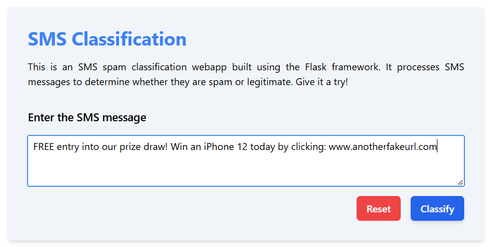

# SMS Spam Classification

This project is a web service for SMS spam classification, built using the [**Flask**](https://flask.palletsprojects.com/en/stable/) framework and deployed on [**Render**](https://docs.render.com/free). It leverages a trained machine learning model to classify SMS messages as either `HAM` (legitimate) or `SPAM`.

## Overview
This web service provides a user interface and an API endpoint to classify SMS messages as **spam** or **ham** based on a trained machine learning model. The application utilizes a **Random Forest Classifier** and **TF-IDF vectorizer**, stored in [rfc-model.pkl](./rfc-model.pkl) and [tfidf-vectorizer.pkl](./tfidf-vectorizer.pkl) files, respectively.

## Setup

### Prerequisites

* Python 3.8+
* nltk
* scikit-learn
* Flask

    For more details, refer to the [requirements.txt](./requirements.txt) for this project.

### Installation

1. **Clone the repository** :

    ```bash
    git clone https://github.com/nirmit27/SMS-Spam-Classifier.git
    cd sms-spam-classifier
    ```

2. **Install dependencies** :

    ```bash
    pip install -r requirements.txt
    ```

3. **Run the application locally** :

    ```bash
    python app.py
    ```

    The application will be available at **http://127.0.0.1:5000** if you have followed through correctly.

## Usage

### Local Testing

To classify a message, you can use the `/api/label` endpoint :

```bash
curl -X POST http://127.0.0.1:5000/api/label -H "Content-Type: application/json" -d '  {"message": "Congratulations! You have won a prize."}'
```

## Preview

Here are screenshots of the application in action :

* Taking user input in the text box to classify an SMS message.
  
  

* Displaying the classification result as "HAM" or "SPAM" based on the input.

    

## API Endpoint

#### `POST /api/label`

* **Description**: Classifies an SMS message as HAM or SPAM.
* **Request Body**: JSON object with a single key :
  
    ```json
    {
      "message": "Your SMS message here."
    }
    ```

* **Response**: JSON object with the classification label :
  
    ```json
    {
      "message": "Your SMS message here.",
      "label": "HAM" // or "SPAM"
    }
    ```

## Error Handling
The application handles errors with custom templates :

* **404 Not Found :** Returns a `404` page if the route does not exist.
* **500 Internal Server Error :** Returns a `500` page for server-related errors.

## Deployment

#### **Link** : [Web Service on Render](https://sms-spam-classifier-ofm6.onrender.com/)

> If you are on the **Hobby** plan on Render *(like me)*, mind your **Monthly Free Usage** information.

## License
This project is licensed under the [MIT](https://opensource.org/license/mit) License.
